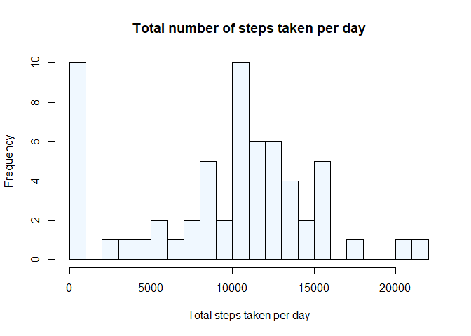
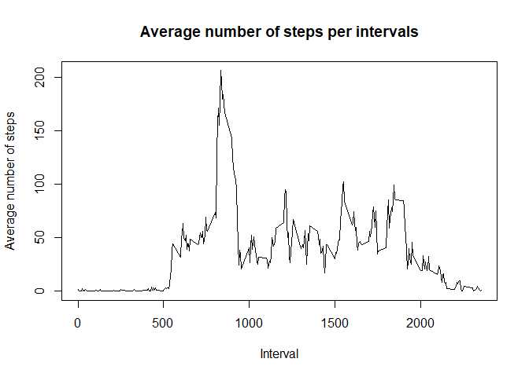
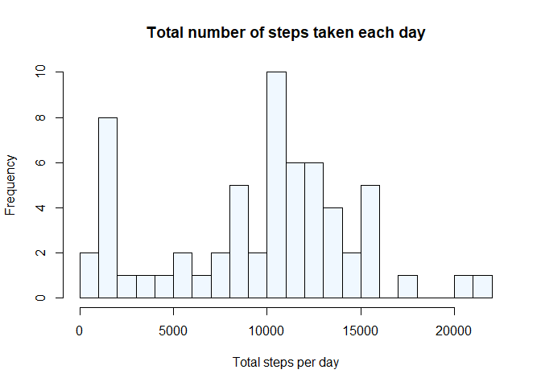
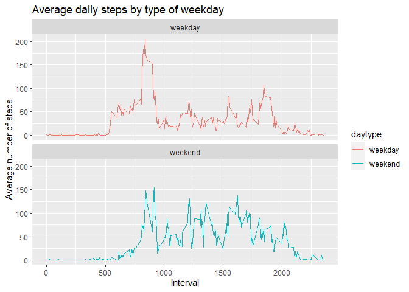

\#\#Setting *echo = TRUE* so that all code chunks would be visible:

    knitr::opts_chunk$set(echo=TRUE,warning = FALSE)

Loading and preprocessing the data
----------------------------------

    library(ggplot2)
    activity<-read.csv("C:/Users/Ananya/Documents/activity.csv",na.strings = "NA")
    attach(activity)
    activity$date <- as.POSIXct(activity$date, "%Y-%m-%d")
    str(activity)

    ## 'data.frame':    17568 obs. of  3 variables:
    ##  $ steps   : int  NA NA NA NA NA NA NA NA NA NA ...
    ##  $ date    : POSIXct, format: "2012-10-01" "2012-10-01" ...
    ##  $ interval: int  0 5 10 15 20 25 30 35 40 45 ...

What is mean total number of steps taken per day?
-------------------------------------------------

    total_steps<-with(activity,aggregate(steps,by=list(date),FUN=sum,na.rm=TRUE))
    names(total_steps)<-c("date","steps")
    hist(total_steps$steps,col="aliceblue",main = "Total number of steps taken per day", xlab = "Total steps taken per day",breaks = 20)

Mean of the total number of steps per day -

    mean_steps <- mean(total_steps$steps)
    mean_steps

    ## [1] 9354.23

Median of the total number of steps per day -

    median_steps <- median(total_steps$steps)
    median_steps

    ## [1] 10395

What is the average daily activity pattern?
-------------------------------------------

    avg_daily_activity <- aggregate(activity$steps, by=list(activity$interval), FUN=mean, na.rm=TRUE)
    names(avg_daily_activity) <- c("interval", "mean")
    str(avg_daily_activity)

    ## 'data.frame':    288 obs. of  2 variables:
    ##  $ interval: int  0 5 10 15 20 25 30 35 40 45 ...
    ##  $ mean    : num  1.717 0.3396 0.1321 0.1509 0.0755 ...

    plot(avg_daily_activity$interval, avg_daily_activity$mean, type = "l", xlab="Interval", ylab="Average number of steps", main="Average number of steps per intervals")

The 5-minute interval which on average across all the days in the data
set, contains the maximum number of steps is:

    avg_daily_activity[which.max(avg_daily_activity$mean), ]$interval

    ## [1] 835

Imputing missing values
-----------------------

1.  Calculate and report the total number of missing values in the
    dataset (i.e. the total number of rows with NAs)

<!-- -->

    sum(is.na(activity$steps))

    ## [1] 2304

1.  Devise a strategy for filling in all of the missing values in the
    dataset. The strategy does not need to be sophisticated. For
    example, you could use the mean/median for that day, or the mean for
    that 5-minute interval, etc.

<!-- -->

    #Imputing median values of intervals to NA steps
    modified_steps <- activity$steps 
    modified_steps[is.na(modified_steps)] <- tapply(activity$steps,activity$interval,median,na.rm=TRUE) 
    str(modified_steps)

    ##  int [1:17568] 0 0 0 0 0 0 0 0 0 0 ...

1.  Create a new dataset that is equal to the original dataset but with
    the missing data filled in.

<!-- -->

    activity_new <- data.frame(steps=modified_steps, interval=activity$interval, date=activity$date)
    str(activity_new)

    ## 'data.frame':    17568 obs. of  3 variables:
    ##  $ steps   : int  0 0 0 0 0 0 0 0 0 0 ...
    ##  $ interval: int  0 5 10 15 20 25 30 35 40 45 ...
    ##  $ date    : POSIXct, format: "2012-10-01" "2012-10-01" ...

1.  Make a histogram of the total number of steps taken each day and
    calculate and report the mean and median total number of steps taken
    per day. Do these values differ from the estimates from the first
    part of the assignment? What is the impact of imputing missing data
    on the estimates of the total daily number of steps?

<!-- -->

    total_steps_imputed <- with(activity_new,aggregate(steps,by=list(date),sum))  
    names(total_steps_imputed) <- c("date", "steps")
    str(total_steps_imputed)

    ## 'data.frame':    61 obs. of  2 variables:
    ##  $ date : POSIXct, format: "2012-10-01" "2012-10-02" ...
    ##  $ steps: int  1141 126 11352 12116 13294 15420 11015 1141 12811 9900 ...

    hist(total_steps_imputed$steps, col = "aliceblue", xlab = "Total steps per day", main = "Total number of steps taken each day", breaks = 20)

New Mean:

    mean_steps<-mean(total_steps_imputed$steps)
    mean_steps

    ## [1] 9503.869

New Median:

    median_steps<-median(total_steps_imputed$steps)
    median_steps

    ## [1] 10395

So here, we see that the new mean and median respectively are 9503.869
and 10395 as compared to the previous values of 9354.23 and 10395.

Are there differences in activity patterns between weekdays and weekends?
-------------------------------------------------------------------------

    activity_new$date <- as.Date(strptime(activity_new$date, format="%Y-%m-%d"))
    activity_new$weekday <- weekdays(activity_new$date)
    activity_new$daytype <- ifelse(activity_new$weekday=='Saturday' | activity_new$weekday=='Sunday', 'weekend','weekday')
    head(activity_new,n=10)

    ##    steps interval       date weekday daytype
    ## 1      0        0 2012-10-01  Monday weekday
    ## 2      0        5 2012-10-01  Monday weekday
    ## 3      0       10 2012-10-01  Monday weekday
    ## 4      0       15 2012-10-01  Monday weekday
    ## 5      0       20 2012-10-01  Monday weekday
    ## 6      0       25 2012-10-01  Monday weekday
    ## 7      0       30 2012-10-01  Monday weekday
    ## 8      0       35 2012-10-01  Monday weekday
    ## 9      0       40 2012-10-01  Monday weekday
    ## 10     0       45 2012-10-01  Monday weekday

    table <- aggregate(steps~interval+daytype,data=activity_new,FUN=mean)
    plot<- ggplot(table, aes(x = interval , y = steps, color = daytype)) + geom_line() + labs(title = "Average daily steps by type of weekday", x = "Interval", y = "Average number of steps") +
           facet_wrap(~daytype, ncol = 1, nrow=2)
    print(plot)

